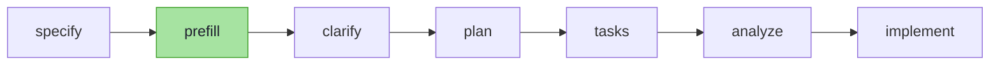

> **AI Adoption Journey (a 4-part series)** — From fear to growth, since I started handing my work over to AI: a record of the path I've walked.
> 1. **Trying Every Tool Until I Built My Own** ← you are here
> 2. [The System AI 'Works' In — Engineering and Verification Ownership](/en/blog/ai-adoption-journey-2-engineering)
> 3. [When the AI Server Goes Down, I Turn Into an Idiot Too — Local LLMs and AI Dependence](/en/blog/ai-adoption-journey-3-local-llm)
> 4. [Chasing AI, Alongside AI — Even How I Learn Has Changed](/en/blog/ai-adoption-journey-4-learning)

I've tried a good number of AI coding tools since February 2026 — **Kiro, Cursor, the GPT browser window, Claude Code, using-superpower, gstack, speckit.** These days I run speckit with a `prefill` skill I built myself layered on top.

Each tool had something it did well, and each one genuinely reshaped how I worked for a while. The more I used them, the clearer it became: **some problems, tools solve well; others still need a human and a system to fill the gap.** This post is a record of that observation — not a tool recommendation, but an account of how I read each tool's strengths and limits and combined them into a workflow that fits me.

## The Starting Point — When I Still Hand-Wrote Half My Code

In February 2026, my workflow was bouncing between Kiro, Cursor, and a browser tab with GPT open. I hand-wrote half my work and handed the other half to AI. More precisely, I spent more time polishing prompts to hand things off well than actually writing code. Back then, the buzzword was "prompt engineering."

I didn't trust AI at the time. **It was smart, but not smart enough that I'd trust it with everything.** Even so, the amount of code I typed myself was already shrinking. I doubted it, but my hands kept handing more over anyway.

One person changed the game. A senior developer who'd been out for a long stretch came back, and his pace was off the charts. He caught up on months of accumulated changes in days, tore through gnarly legacy code without hesitation, and even built a QA web tool in almost no time. At first I chalked it up to experience. It was much later that I learned a top-tier Claude Code plan was behind that speed. Word of it reached upper management, and the company declared a company-wide AI rollout.

I remember that day as the first time I looked AI in the eye.

## The First Shift — I Stopped Writing Code Myself

What I got was Claude Code. I didn't know how to switch models, though, so **even with Opus sitting right there, I worked with Sonnet only for 2–3 weeks.** Sonnet alone was enough to send my development speed through the roof.

What convinced me wasn't the speed itself. Boilerplate, repetitive CRUD, refactors that just followed an existing pattern — the stuff that was pure tedium to type by hand — even Sonnet handled these just fine. Once that clicked, my reason for typing it myself disappeared. What was left wasn't typing. It was judgment.

That's when I decided — **I'd stop writing code myself.** I'd supervise instead. My doubt hadn't gone away, though, so I verified AI's output line by line. Looking back, this "habit of doubt" turned out to be the best decision I made from that point on. (I cover how I turned that verification into an actual system in [Part 2](/en/blog/ai-adoption-journey-2-engineering).)

Alongside that, anxiety crept in for the first time. *"If AI is already this good, what happens to my job?"* That fear runs through this entire series. It keeps following me, just changing shape each time.

## using-superpower — The Power of Automation, and the Tokens Leaking Out

In mid-March, I installed [using-superpower](https://github.com/obra/superpowers) — an open-source-ish bundle of pre-built task skills that sit on top of Claude Code. Things prompts alone couldn't reach — brainstorming, design review, TDD — the skills just handled on their own. It hit me the same way the first day I turned AI loose on my work.

But I soon hit a ceiling. Once I'd gotten comfortable with using-superpower and started leaning on it hard, **my 5-hour token limit and weekly token limit both started running dry.** The cause was how the skills auto-triggered. Tools like using-superpower are wired to hooks. When a hook detects the working context and decides "this skill is needed right now," it pulls the full skill body into the prompt — whether I called for it or not.

```
One lightweight question
  → hook detects context
  → injects the heavy skill body (instructions + context) into the prompt
  → prompt tokens balloon all at once
```

**This was the price of convenience.** Whether I wanted it or not, the hook injected a skill every single time, and my tokens melted away.

As luck would have it, the team's hot topic at the time was "[harness engineering](https://www.anthropic.com/engineering/effective-harnesses-for-long-running-agents)." I dug into harness engineering myself and tried applying it to my own work. Then I took it a step further — **I sank an entire week into building an in-house harness tool from scratch. It flopped, completely.** What I ended up with was a monster that guzzled tokens and performed just okay. I archived it without a second thought.

> **Quick aside —** the reason it flopped was clear. I'd tried to make it "always on, handling everything automatically," which meant it was jamming skills and context into every moment, including the ones that didn't need any. I'd repeated, with my own hands, the exact mistake that burned tokens through using-superpower's hooks. A good harness isn't about automating *a lot* — it's about attaching *only what's needed, when it's needed*.

**Lesson 1:** Automation costs you even when you're not using it. The smarter the hook, the more it eats into your token limit — even in the moments you never called it.

## gstack — The Light of Clarification, the Shadow of Over-Engineering

While my token limit was still tight, I tried [gstack](https://github.com/garrytan/gstack) — another skill suite, this one strong at design review and clarification. And gstack turned out to fit my situation perfectly at the time.

The situation was strange — there was no proper spec, just a decision to "rebuild the entire app from scratch." gstack's strength is filling exactly that kind of void: **clarification**. It pinpointed the ambiguous spots, broke them into dozens of questions, and by the time I'd answered them, the fuzzy policy had come into focus.

Keep using it, and the shadow showed up too. **gstack kept trying to nail down details for a future way too far off.** It chased over-engineering, insisting on a design that would hold up for five or ten years. Scalability and abstraction we didn't need yet piled up in the design, and we ended up spending more time trimming that excess than building the thing itself.

The light of clarification ≠ free. The brighter the light, the longer the shadow it cast.

Around this time, a new variable entered the picture. **The Claude models themselves were getting scarily good, scarily fast.**

## What Was Left Once Tool Dependence Faded

As the models got stronger, I leaned on external tools less. Work that used to require a skill, the model now handled to a decent degree on its own, bare-handed.

The frequency dropped, but one thing never went away — **the frame of policy and planning, and clarification itself.** No matter how smart the model is, if what you're building is fuzzy, the output stays fuzzy too. A strong model ≠ clear requirements. So the team's question narrowed down to this: *how do we make clarification sharper at a lower cost?*

## speckit — My Current Go-To, and the Wall Called clarify

I heard companies that lean heavily on AI were using [speckit](https://github.com/github/spec-kit), so I adopted it. It's a spec-driven development workflow tool — you nail down the spec first, then drive it all the way through to implementation. It fit well, so it's still my main tool today (though as the models got stronger, I've reached for it a bit less). speckit had neither gstack's bloated clarification nor using-superpower's runaway token cost.

speckit's skeleton is simple. `specify` nails down the spec, `clarify` flags the ambiguities. clarify finding the gaps was genuinely useful. But the more I used it, the more two things bothered me.

- **There could be dozens of candidate questions, but at most five surface at a time.** So there was no way to know how many more rounds of `clarify` it would take to get things clear enough. Clarification with no visible end wore me down.
- **The questions themselves were written in sentences that were hard for a human to read** — verbose prose neatly organized for an AI's taste, not a person's. The same fatigue I'd hit with gstack came right back.

There were upsides too. Decisions made through clarify got written down as a formal "constitution," which became a guardrail for every task after. That's a genuine strength. Still, the more rounds I went back and forth with speckit, the more the fatigue built up.

I got some advice, too: write the spec clearly enough from the start, and the number of questions clarify throws at you drops sharply. That's true. But I could barely ever clear that bar. Writing a "sufficiently clear spec" by hand was, itself, a whole separate problem.

## The Root Cause — clarify Never Looks at the Code

When fatigue builds up, the instinct is usually to go look for a new tool. This time, instead of hunting for another tool, I dug into the cause. Too many questions, hard to read — those were *symptoms*. I figured there had to be a separate *cause* producing them.

The cause was simple. **speckit's clarify never looks at the actual codebase.** It builds its questions purely by "guessing," working only from the given spec and the constitution. Because of that, it kept asking me things you could answer just by opening the code. "Does this entity already have this field?" — questions where the code already held the answer.

At first, I tried making a hook search the codebase automatically. But that meant every single question triggered a fresh code search plus a "do we even need to ask this" judgment call — and this time, tokens started leaking. The same trap I'd already seen with using-superpower.

## The Skill I Built Myself — `prefill`

So I built a skill of my own, called `prefill`. Instead of auto-triggering it through a hook — I'd already seen where that trap leads — I inserted it between `specify` and `clarify` in the speckit pipeline, as a step I call explicitly when I need it (a Claude Code skill invoked via slash command). The core idea wasn't *what* it did — it was *where* it did it.

```
# ❌ Hook searches the codebase for every single question → lookup cost scales with question count (token leak)
# ✅ prefill runs one codebase lookup right after specify, batched into a single pass → cost paid once
```

Slotted into the pipeline, the flow looks like this. `prefill` is the only step I added.



*Before* clarify ever throws a question, prefill searches both the codebase and an LLM wiki I'd built myself — an Obsidian-based store of project domain knowledge and policy decisions (more on this in [Part 2](/en/blog/ai-adoption-journey-2-engineering)) — and **pre-fills whatever the code and the record can already answer** straight into the spec. The core idea is separation: **splitting "questions the code can answer" from "questions only a human can answer," and routing the former to an automatic resolution step.**

Here's how it works. First, it pulls a complete list of every item that shows up in the spec. For each item, it spins up a parallel subagent that cross-references the codebase's service and entity signatures, project rules and DDL, neighboring specs, and prior decisions accumulated in the Obsidian wiki and memory — and looks for an answer. The results land in three buckets: **items confirmed with evidence — file and line number — (Resolved), items that are inferred and need human review (Assumed), and items only a human can genuinely answer (Needs Clarification).** Anything without evidence never gets bumped up to Resolved carelessly. Only that last bucket makes it to clarify.

For example, run the spec for an "account deletion" feature through prefill, and the spec document gets filled in something like this.

```text
## Resolved
- The User entity already has a deleted_at field → can be handled with a soft-delete (user.entity.ts:45)

## Assumed
- Assuming deletion follows the soft-delete pattern (see project rule-04 — needs human confirmation)

## Needs Clarification
- Should data be held for a 30-day grace period after deletion, or deleted immediately? — needs a policy decision
```

The first two buckets got answered by code and by the record. Only that last line makes it to the human.

The result: fewer rounds of `clarify` needed, and fewer questions for a human to answer. More than anything, only the questions actually worth a human's time were left. I shared it with the team, and I could see people actually using it. It was the first time, after purely consuming other people's tools, that I'd built a small one that fit my own workflow and actually contributed something back.

**Lesson 2:** When a symptom keeps recurring, dig for the cause before reaching for a new tool. clarify's question bombardment was just a symptom of one root cause — it was built on guesswork.

## My Workflow Today

After going through all these tools, this is the workflow I've settled into.

1. Talk with Claude to build up working context and information.
2. Lock down the spec with speckit's `specify`.
3. Use `prefill` to pre-fill whatever the code and the record can answer.
4. Clarify only what's left and actually matters, with `clarify`.
5. Go through `plan` → `tasks` → `analyze`, then all the way to implementation with `implement`.

For now, this is the flow I'm happiest with. **Honestly, though, I already know this satisfaction won't last.** The paradigm shifts on a timescale of weeks, at most.


There's no clean finish line for tool use. Some tools are strong at clarification, some at execution, some have a better cost structure. What matters isn't picking one and discarding the rest — it's reading where each tool excels and where it falls short, then combining them into a workflow that fits you.

## Wrapping Up

- **Automation costs you even when you're not using it.** Auto-triggered hooks burned tokens as the price of convenience (using-superpower, my own harness).
- **A strong model ≠ clear requirements.** No matter how good the model gets, clarification still has to happen. A tool's job is to make that clarification cheaper.
- **When a symptom keeps recurring, dig for the cause before reaching for a new tool.** clarify's question bombardment came down to "guessing without looking at the code," and the fix was `prefill`.

The next post covers what actually changed more, underneath all this tool-hopping — **the way I work, itself** — and how someone as skeptical as me turned verification into an actual system.

---

> **Continue reading:** [② The System AI 'Works' In — Engineering and Verification Ownership](/en/blog/ai-adoption-journey-2-engineering)
