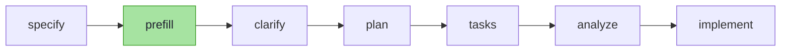

> **AI適応記(全4部)** — AIに仕事を任せ始めてから、恐れから成長へ、僕が歩んできた道の記録。
> 1. **さまざまなツールを試し、最後は自分で作るまで** ← 今読んでいる記事
> 2. [AIが「働く」システム — エンジニアリングと検証オーナーシップ](/ko/blog/ai-adoption-journey-2-engineering)
> 3. [AIサーバーが落ちたら自分も馬鹿になる — ローカルLLMとAI依存](/ko/blog/ai-adoption-journey-3-local-llm)
> 4. [AIを追いかけながら、AIとともに — 学び方まで変わった](/ko/blog/ai-adoption-journey-4-learning)

2026年2月から今まで、かなりの数のAIコーディングツールを試してきた。**Kiro・Cursor・GPTのウィンドウ、Claude Code、using-superpower、gstack、speckit。**そして今は、speckitの上に自分で作った`prefill`スキルを乗せて使っている。

どのツールにも得意分野があり、実際にしばらくの間、自分の作業スタイルを変えた。使うほどに、**ある問題はツールがうまく解決してくれるが、別の問題は依然として人とシステムで補う必要がある**ということが見えてきた。この記事はその観察の記録だ — ツールのおすすめではなく、それぞれの長所と限界をどう読み取り、自分のワークフローに合わせて組み合わせてきたかについての話だ。

## 出発点 — 半分は手で書いていた頃

2026年2月頃の作業は、KiroとCursor、ブラウザのGPTウィンドウを行ったり来たりする形だった。仕事の半分は手で書き、残り半分をAIに任せていた。正確に言えば、うまく任せるためのプロンプト調整に、それ以上の時間を費やしていた。当時の流行り言葉は「プロンプトエンジニアリング」だった。

当時の自分はAIを信頼していなかった。**賢いのは確かだが、全部任せるにはまだ心もとなかった。**それでも、自分の手でタイピングするコード量はすでに減りつつあった。疑いながらも、手はどんどんAIに渡っていく途中だった。

潮目を変えたのは、たった一人の存在だった。長く現場を離れていたシニアエンジニアが復帰したのだが、その仕事のスピードが尋常ではなかった。溜まっていた変更を数日で追いつき、厄介なレガシーコードを次々と片付け、QA用のWebツールまで短時間で作り上げた。最初は経験年数のおかげだと思っていた。そのスピードの裏にClaude Codeの上位プランがあったと知ったのは、ずいぶん後になってからだ。その噂は上層部にまで届き、会社は全社的なAI導入を宣言した。

この日を「AIと正面から向き合った初日」として記憶している。

## 最初の変化 — 自分でコードを書くのをやめた

支給されたのはClaude Codeだった。ところがモデルの切り替え方を知らなかったので、**Opusをすぐ横に置きながらも2〜3週間はSonnetだけ**で仕事をしていた。それでも、そのSonnetだけで開発スピードは飛躍的に上がった。

納得したのは、スピードそのものではなかった。ボイラープレート、繰り返しのCRUD、既存パターンをなぞるだけのリファクタリング — 手で書けば退屈なだけだったそれらを、Sonnetだけで十分にこなしてくれた。そうなると、自分の手でタイピングする理由がなくなった。残るのはタイピングではなく、判断だった。

ここで決めた — **自分の手でコードを書くのはやめる。**代わりに監督に回る。ただ、疑いは消えなかったので、AIの成果物を1行ずつ読み解きながら検証した。今振り返ると、この「疑う習慣」こそが、その後いちばん良かった選択だ。(検証をシステムとして固めていった話は[第2部](/ko/blog/ai-adoption-journey-2-engineering)で扱う。)

その一方で、初めて不安が芽生えた。*「AIがここまでできるなら、自分の居場所はどうなるんだろう。」*この恐れはこのシリーズ全体を貫いている。形を変えながら、ずっとついてくる。

## using-superpower — 自動化の力、そして漏れていくトークン

3月中旬、[using-superpower](https://github.com/obra/superpowers)を導入した。Claude Codeの上に載せて使う、あらかじめ組まれた作業スキルをまとめたオープンソースに近いパッケージだ。プロンプトだけでは届かなかった領域 — ブレインストーミング、設計レビュー、TDD — をスキルが勝手に処理してくれた。AIを初めて使った日の衝撃を、もう一度味わった。

ところが、すぐに上限にぶつかった。using-superpowerに慣れて積極的に使い始めると、**5時間トークンと週間トークンが底を突き始めた。**原因はスキルの自動発動の仕組みにある。using-superpower系のツールはフック(hook)に紐づいて動く。作業のコンテキストを検知したフックが「今このスキルが必要だ」と判断すると、自分が呼んでいなくてもスキル本文をプロンプトに引っ張ってきてくっつける。

```
軽い質問1つ
  → フックがコンテキストを検知
  → 重いスキル本文(指示 + コンテキスト)をプロンプトに注入
  → プロンプトのトークンが一気に膨れ上がる
```

**便利さの代償がこれだった。**望むと望まざるとにかかわらず、フックは毎回スキルを注入し、トークンは溶けるように減っていった。

折悪しく、この時期のチームの話題は「[ハーネス(harness)エンジニアリング](https://www.anthropic.com/engineering/effective-harnesses-for-long-running-agents)」だった。自分もハーネスエンジニアリングを掘り下げて、自分の作業に応用しようとした。そこからさらに一歩踏み込み、**社内向けのハーネスツールを自作しようと1週間を注ぎ込んだ。結果は大失敗だ。**出来上がったのは、トークンばかり食ってパフォーマンスはそこそこという怪物だった。未練なくアーカイブした。

> **補足 —** 大失敗した理由ははっきりしていた。「常にオンにして、勝手に全部やってくれる」ものを作ろうとして、本当は必要もない瞬間までスキルとコンテキストを毎回詰め込んでいたのだ。using-superpowerのフックがトークンを燃やしたのとまったく同じミスを、今度は自分の手で繰り返した。良いハーネスとは*たくさん*自動化することではなく、*必要なときに必要なものだけ*を付け足すことだ。

**教訓1:** 自動化のコストは「使わないときにもかかる」ということだ。フックが賢いほど、呼んでいない瞬間にもトークンの上限が削られていく。

## gstack — 明確化の光、オーバーエンジニアリングの影

トークンの上限がぎりぎりだった時期に、[gstack](https://github.com/garrytan/gstack)を試してみた。設計レビューと明確化に強い、また別のスキルスイートだ。そしてgstackは、当時の状況に絶妙にはまった。

状況は奇妙だった。まともな企画書もないまま、「アプリ全体を作り直そう」という決定だけがあった。gstackの強みは、その空白を埋める**明確化**だ。曖昧な部分をピンポイントで突いて数十個の質問に分解してくれて、答えていくうちに、ぼやけていた方針がくっきりしてきた。

使い続けると、影も見えてきた。**gstackは、あまりに遠い未来まで具体化しようとした。**5年、10年もつ設計を作ろうとして、オーバーエンジニアリングが次々と連鎖した。今はまだ必要のない拡張性や抽象化が設計図に積み上がり、その過剰分を削ぎ落とすのに、それ以上の時間を費やす羽目になった。

明確化の光 ≠ タダ。光が強い分だけ、影も長かった。

この頃、新たな変数が割り込んできた。**Claudeモデル自体のパフォーマンスが、恐ろしいスピードで良くなっていたのだ。**

## ツール依存が減った跡に残ったもの

モデルが強くなると、外部ツールに頼る頻度が減った。以前はスキルが代わりにやっていた仕事を、モデルが素手である程度こなせるようになった。

頻度は減っても、最後まで消えなかったものが一つあった — **方針・企画という枠組み、そして「明確化」そのものだ。**モデルがどれだけ賢くても、何を作るのかがぼやけていれば、成果物もぼやける。強いモデル ≠ 明確な要件。だからチームの問いは、こう絞られていった。*明確化を、どうすればもっと低いコストで、もっとくっきりできるか。*

## speckit — 今の主力、そしてclarifyという壁

AIを積極的に活用している会社が[speckit](https://github.com/github/spec-kit)を使っているという話を聞いて、導入した。まず仕様(spec)を固め、その仕様をもとに実装まで進めていく、仕様駆動開発のワークフローツールだ。相性が良く、今も主力として使っている(モデルが強くなるにつれ、頻度は少しずつ減った)。gstackの肥大化した明確化も、using-superpowerの過剰なトークン消費も、speckitにはなかった。

speckitの骨格はシンプルだ。`specify`で仕様を固め、`clarify`で曖昧な部分を洗い出す。clarifyが抜け漏れを見つけてくれるのはありがたかった。ただ、使うほどに気になる点が2つあった。

- **候補となる質問は数十個あるのに、一度に出てくるのは最大でも5個だけだ。**そのため、あと何回`clarify`を回せば十分に明確になるのか見当がつかなかった。終わりの見えない明確化が、人を疲弊させた。
- **質問が、人には読みづらい文章で書かれていた。**AIにとっては読みやすく整えられた、しかし冗長な文体。gstackで味わったあの疲労が、そのまま戻ってきた。

得たものもあった。clarifyで下した決定が「憲法(constitution)」として明文化され、その後の作業のガードレールになった。これは正真正銘の長所だ。それでも、speckitとのやり取りの回数が増えるほど、疲労は積み重なっていった。

こんなアドバイスをもらったこともある。仕様を最初から十分に明確に書けば、clarifyが投げてくる質問の数がぐっと減る、というものだ。もっともな話だ。だが、自分はその壁をなかなか越えられなかった。「十分に明確なスペック」を素手で書き上げること自体が、また別の宿題だったのだ。

## 根本原因 — clarifyはコードを見ていない

疲労が溜まると、普通は新しいツールを探したくなる。今回は、さらにツールを探すよりも原因を掘り下げることにした。質問が多く読みづらいのは*症状*であり、その症状を生んでいる*原因*が別にあるはずだと考えた。

原因は単純だった。**speckitのclarifyは、実際のコードベースを見ていない。**与えられた仕様と憲法の情報だけで「推測」して質問を作る。そのせいで、コードを開けば答えが出るようなことまで人に聞き返してきた。「このエンティティに、このフィールドはもう存在しますか?」— コードが答えを握っている質問たちだ。

最初は、フックにコードベースを漁らせるようにしてみた。ところが、質問のたびにコードを探索し、「この質問は必要か」を判定する処理が挟まるので、今度はトークンが漏れ出した。using-superpowerで見たのと同じ罠だ。

## 自作したスキル — `prefill`

そこで、`prefill`というスキルを自分で作った。フックで自動発動させる代わりに — その罠はもう見ているので — speckitパイプラインの`specify`と`clarify`の間に挟み込み、必要なときに自分で呼び出すステップ(スラッシュコマンドで呼び出すClaude Codeスキル)として置いた。発想の肝は、*どこで*働くかだった。

```
# ❌ フックが質問のたびにコードベースを探索 → 質問数に比例して参照コストが増える(トークン漏れ)
# ✅ specify直後のprefillという1ステップに、コードベース参照を1回にまとめる → コストは1回だけ
```

パイプラインに組み込むと、流れはこうなる。`prefill`だけが自分が加えたステップだ。



clarifyが質問を投げる*前に*、コードベースと、自分で整理しておいたプロジェクトのドメイン知識・方針をまとめたLLMウィキ(Obsidianベース、詳しくは[第2部](/ko/blog/ai-adoption-journey-2-engineering)で)を一緒に洗い、**コードと記録だけで答えられる項目をあらかじめ埋めて**仕様に書き込んでおく。肝は分離だ — **「コードが答える質問」と「人が答える質問」を切り分け、前者を自動解決ステップに回したこと。**

やり方はこうだ。まず、仕様に登場する項目を漏れなくリストアップする。項目ごとに並列でサブエージェントを立ち上げ — コードベースのサービス・エンティティのシグネチャ、プロジェクトのルールとDDL、隣接する仕様、そしてObsidianウィキとメモリに蓄積された過去の決定 — を照らし合わせて答えを探す。結果は3つの欄に書き分けられる。**証拠(ファイルと行番号)付きで確定した答えが出たもの(Resolved)、推論であり人によるレビューが必要なもの(Assumed)、本当に人にしか答えられないもの(Needs Clarification)。**証拠を示せない項目は、安易にResolvedへ格上げしない。clarifyに渡るのは最後の欄だけだ。

たとえば「会員退会」機能の仕様をprefillに通すと、仕様書にはこんな具合に答えが埋まっていく。

```text
## Resolved
- Userエンティティにdeleted_atフィールドがすでに存在 → soft-deleteで処理可能 (user.entity.ts:45)

## Assumed
- 退会はsoft-deleteパターンに従うと仮定 (プロジェクトルールrule-04参照 — 人による確認が必要)

## Needs Clarification
- 退会後のデータを30日間の猶予期間保管するか、即座に削除するか — ポリシー決定が必要
```

前の2つの欄はコードと記録が答えてくれて、人に回ってくるのは最後の1行だけだ。

結果、`clarify`を繰り返す回数と、人が答えるべき質問の数が減った。何より、人が答える価値のある質問だけが残った。チームメンバーに共有すると、実際にみんなが使っているのが見えた。ツールを消費するだけの側から、初めて自分のワークフローに合う小さなツールを作って貢献する側に回った瞬間だ。

**教訓2:** 症状が繰り返されるなら、新しいツールを探すより先に原因を掘れ。clarifyの質問攻めは、「推測ベース」というたった一つの原因が生んだ症状だった。

## 今のワークフロー

いろいろなツールを試した末に、今の作業の流れはこう落ち着いた。

1. Claudeと対話しながら、作業のコンテキストと情報を蓄積する。
2. speckitの`specify`で仕様を固める。
3. `prefill`で、コードと記録が答えられる部分をあらかじめ埋める。
4. `clarify`で、残った肝の部分だけを明確化する。
5. `plan` → `tasks` → `analyze`を経て、`implement`で実装まで進める。

今のところ、この流れがいちばん満足度が高い。**正直に言えば、この満足も長くは続かないとわかっている。**パラダイムは、長くてもせいぜい数週間単位で変わっていく。


ツール選びに、きれいな終着点はない。ある道具は明確化に強く、ある道具は実行に強く、ある道具はコスト構造が優れている。大事なのは一つを選んで残りを捨てることではなく、それぞれの道具が得意な点と手薄な点を読み取り、自分のワークフローに合わせて組み合わせることだ。

## まとめ

- **自動化のコストは、使わないときにもかかる。**フックの自動発動は、便利さの代償としてトークンを燃やした(using-superpower、自作ハーネス)。
- **強いモデル ≠ 明確な要件。**モデルが良くなっても、明確化という作業は残る。道具の役目は、その明確化を安く済ませることだ。
- **症状が繰り返されるなら、新しいツールを探すより先に原因を掘れ。**clarifyの質問攻めの原因は「コードを見ない推測」であり、その答えが`prefill`だった。

次の記事では、いろいろなツールを試している間に、実はもっと大きく変わっていたもの — **働き方そのもの**と、疑い深かった自分が検証をどうやってシステムとして固めていったのかを取り上げる。

---

> **続きの記事:** [② AIが「働く」システム — エンジニアリングと検証オーナーシップ](/ko/blog/ai-adoption-journey-2-engineering)
