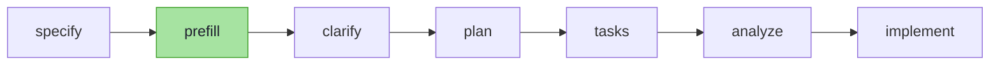
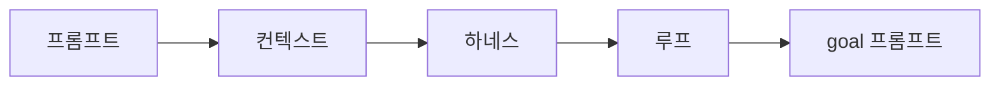

> **AI 적응기 (4부작)** — AI에 일을 맡기기 시작한 뒤로 두려움에서 성장까지, 내가 지나온 길의 기록.
> 1. **여러 도구를 써보고, 결국 직접 만들기까지** ← 지금 읽는 글
> 2. [AI와 '일하는' 시스템 — 엔지니어링과 검증 오너십](/ko/blog/ai-adoption-journey-2-engineering)
> 3. [AI 서버가 죽으면 나도 바보가 된다 — 로컬 LLM과 AI 의존](/ko/blog/ai-adoption-journey-3-local-llm)
> 4. [AI를 쫓아가며, AI와 함께 — 배움의 방식까지 바뀌다](/ko/blog/ai-adoption-journey-4-learning)

2026년 2월부터 지금까지 꽤 많은 AI 코딩 도구를 써봤다. **Kiro·Cursor·GPT 창, Claude Code, using-superpower, gstack, speckit.** 그리고 지금은 speckit 위에 직접 만든 `prefill` 스킬을 얹어 쓴다.

각 도구는 각자 잘하는 일이 있었고, 실제로 한동안 내 작업 방식을 바꿨다. 써볼수록 **어떤 문제는 도구가 잘 풀고, 어떤 문제는 여전히 사람과 시스템이 보완해야 한다**는 것이 보였다. 이 글은 그 관찰의 기록이다 — 도구 추천이 아니라, 도구의 장점과 한계를 어떻게 읽고 내 워크플로우에 맞게 조합했는지에 대한.

## 시작점 — 절반은 손으로 짜던 시절

2026년 2월의 작업은 Kiro와 Cursor, 브라우저 GPT 창을 번갈아 오가는 식이었다. 일의 절반은 손으로 짜고, 나머지 절반을 AI에게 넘겼다. 정확히는, 잘 넘기려고 프롬프트를 다듬는 데 더 많은 시간을 썼다. 당시 화두는 '프롬프트 엔지니어링'이었다.

그때 나는 AI를 신뢰하지 않았다. **똑똑한데, 전부 맡기기엔 미덥지 않았다.** 그래도 직접 타이핑하는 코드량은 이미 줄고 있었다. 의심하면서도 손은 넘어가는 중이었다.

판을 바꾼 건 한 사람이었다. 오래 자리를 비웠던 시니어 개발자가 복귀했는데, 일하는 속도가 이상했다. 쌓인 변경을 며칠 만에 따라잡고, 까다로운 레거시를 거침없이 정리하고, QA용 웹 도구까지 짧은 시간에 만들어냈다. 처음엔 연차 덕이라 여겼다. 그 속도 뒤에 Claude Code 상위 플랜이 있었다는 건 한참 뒤에 알았다. 그 소문이 윗선까지 닿았고, 회사는 전사 AI 도입을 선언했다.

이날을 'AI와 정면으로 마주한 첫날'로 기억한다.

## 첫 번째 변화 — 직접 코딩을 멈췄다

받은 건 Claude Code였다. 그런데 모델 바꾸는 법을 몰라서, **Opus를 옆에 두고도 2~3주를 Sonnet으로만** 일했다. 그 Sonnet만으로도 개발 속도는 비약적으로 올랐다.

납득한 건 속도 자체가 아니었다. 보일러플레이트, 반복되는 CRUD, 기존 패턴을 따라가는 리팩터링 — 손으로 치면 지루하기만 하던 것들을 Sonnet조차 충분히 해냈다. 그러자 내가 직접 타이핑할 이유가 사라졌다. 남는 건 타이핑이 아니라 판단이었다.

여기서 결정했다 — **직접 코드를 짜는 일을 그만둔다.** 대신 감독한다. 다만 의심은 남아서, AI 결과물을 한 줄씩 뜯어보며 검증했다. 지금 돌아보면 이 '의심의 습관'이 이후 가장 잘한 선택이다. (검증을 시스템으로 굳힌 이야기는 [2편](/ko/blog/ai-adoption-journey-2-engineering)에서 다룬다.)

그러면서 처음으로 불안이 자랐다. *'AI가 이 정도면, 내 자리는 어떻게 되나.'* 이 두려움은 이 시리즈를 관통한다. 모양을 바꿔가며 계속 따라온다.

## using-superpower — 자동화의 힘, 그리고 새는 토큰

3월 중순, [using-superpower](https://github.com/obra/superpowers)를 깔았다. Claude Code에 얹어 쓰는, 미리 짜인 작업 스킬을 모아둔 오픈소스에 가까운 묶음이다. 프롬프트만으로는 닿지 않던 곳 — 브레인스토밍, 설계 리뷰, TDD — 을 스킬이 알아서 처리했다. AI를 처음 켜던 날의 충격을 한 번 더 느꼈다.

그런데 곧 한도에 부딪혔다. using-superpower에 익숙해져 도구를 적극적으로 쓰기 시작하자, **5시간 토큰과 주간 토큰이 거덜나기 시작했다.** 원인은 스킬의 자동 발동 구조다. using-superpower류는 훅(hook)에 묶여 동작한다. 작업 맥락을 감지한 훅이 "지금 이 스킬이 필요하다"고 판단하면, 내가 부르지 않아도 스킬 본문을 프롬프트에 끌어다 붙인다.

```
가벼운 질문 1개
  → 훅이 맥락 감지
  → 무거운 스킬 본문(지침 + 컨텍스트)을 프롬프트에 주입
  → 프롬프트 토큰이 통째로 부풀어 오름
```

**편의성의 대가가 이것이었다.** 원하든 원치 않든 훅이 매번 스킬을 주입했고, 토큰이 녹아내렸다.

하필 이 시기 팀 화두는 '[하네스(harness) 엔지니어링](https://www.anthropic.com/engineering/effective-harnesses-for-long-running-agents)'이었다. 나도 하네스 엔지니어링을 파고들며 내 작업에 적용해보려 했다. 그러다 한 발 더 나가, **사내용 하네스 도구를 직접 만들겠다고 일주일을 갈아 넣었다. 결과는 폭망이다.** 완성된 건 토큰만 잔뜩 먹고 성능은 그저 그런 괴물이었다. 미련 없이 아카이브했다.

> **잠깐 —** 폭망한 이유는 분명했다. '항상 켜두고 알아서 다 해주게' 만들려다, 정작 필요도 없는 순간까지 스킬과 컨텍스트를 매번 욱여넣은 것이다. using-superpower의 훅이 토큰을 태운 것과 똑같은 실수를, 이번엔 내 손으로 반복했다. 좋은 하네스는 *많이* 자동화하는 게 아니라 *필요할 때 필요한 것만* 붙인다.

**교훈 1:** 자동화의 비용은 '안 쓸 때도 든다'. 훅이 똑똑할수록, 안 부른 순간에도 토큰 한도가 깎인다.

## gstack — 명확화의 빛, 오버엔지니어링의 그림자

토큰 한도가 빠듯하던 시기에 [gstack](https://github.com/garrytan/gstack)을 써봤다. 설계 리뷰와 명확화에 강한 또 다른 스킬 스위트다. 그리고 gstack은 당시 상황에 절묘하게 맞았다.

상황이 기묘했다. 정확한 기획서도 없이 "앱 전체를 새로 짓자"는 결정만 있었다. gstack의 강점은 그 빈 곳을 메우는 **명확화**다. 모호한 지점을 콕 집어 수십 개 질문으로 쪼개주고, 답해가다 보면 흐릿하던 정책이 또렷해졌다.

계속 쓰자 그림자가 보였다. **gstack은 너무 먼 미래까지 구체화하려 들었다.** 5년, 10년 버틸 설계를 만들겠다며 오버엔지니어링이 꼬리를 물었다. 지금 필요하지도 않은 확장성과 추상화가 설계도에 쌓였고, 우리는 그 과잉을 쳐내는 데 더 많은 시간을 썼다.

명확화의 빛 ≠ 공짜. 빛이 강한 만큼 그림자도 길었다.

이 무렵 변수가 끼어들었다. **Claude 모델 자체의 성능이 무섭게 좋아지고 있었다.**

## 도구 의존이 줄어든 자리에 남은 것

모델이 강해지자 외부 도구에 기대는 빈도가 줄었다. 예전엔 스킬이 대신 하던 일을 모델이 맨몸으로 어느 정도 해냈다.

빈도는 줄어도 끝내 사라지지 않는 게 하나 있었다 — **정책·기획이라는 틀, 그리고 '명확화' 자체.** 모델이 똑똑해도 무엇을 만들지가 흐릿하면 결과물도 흐릿하다. 강한 모델 ≠ 명확한 요구사항. 그래서 팀 질문은 이렇게 좁혀졌다. *명확화를 어떻게 더 적은 비용으로 더 또렷하게 할까.*

## speckit — 지금의 주력, 그리고 clarify의 벽

AI를 적극 활용하는 회사들이 [speckit](https://github.com/github/spec-kit)을 쓴다는 이야기를 듣고 도입했다. 명세(spec)를 먼저 잡고 그 명세로 구현까지 끌고 가는, 명세 기반 개발 워크플로우 도구다. 잘 맞아서 지금도 주력으로 쓴다(모델이 강해지며 빈도는 조금씩 줄었다). gstack의 비대한 명확화도, using-superpower의 과도한 토큰도 speckit엔 없었다.

speckit 골격은 단순하다. `specify`로 명세를 잡고 `clarify`로 모호함을 짚는다. clarify가 빈틈을 찾아주는 건 좋았다. 하지만 쓸수록 두 가지가 걸렸다.

- **질문 후보는 수십 개가 있는데, 한 번에 최대 다섯 개만 나온다.** 그래서 몇 번을 더 `clarify`해야 충분히 명확해지는지 알 수 없었다. 끝이 보이지 않는 명확화가 사람을 지치게 했다.
- **질문이 사람이 읽기 힘든 문장으로 쓰여 있었다.** AI가 읽기 좋게 정돈된 장황한 문체. gstack에서 겪은 그 피로가 그대로 돌아왔다.

얻은 것도 있었다. clarify로 내린 결정이 '헌법(constitution)'으로 명문화되어 이후 작업의 가드레일이 됐다. 이건 진짜 장점이다. 그래도 speckit과 주고받는 횟수가 늘수록 피로는 쌓였다.

들은 조언도 있었다. 스펙을 처음부터 충분히 명확하게 쓰면 clarify가 던지는 질문 수가 확 줄어든다는 것. 맞는 말이다. 하지만 나는 그 벽을 좀처럼 넘지 못했다. '충분히 명확한 스펙'을 맨손으로 써내는 일 자체가 또 다른 숙제였다.

## 근본 원인 — clarify는 코드를 안 본다

피로가 쌓이면 보통 새 도구를 찾고 싶어진다. 이번엔 도구를 더 찾기보다 원인을 팠다. 질문이 많고 읽기 힘든 건 *증상*이고, 그 증상을 만드는 *원인*이 따로 있다고 봤다.

원인은 단순했다. **speckit의 clarify는 실제 코드베이스를 보지 않는다.** 주어진 명세와 헌법 정보만으로 '추측'해 질문을 만든다. 그 탓에 코드만 열면 답이 나오는 것까지 사람에게 되물었다. "이 엔티티에 이런 필드가 이미 있나요?" — 코드가 답을 쥔 질문들이다.

처음엔 훅에서 코드베이스를 뒤지게 만들어 봤다. 그런데 질문마다 코드를 탐색하고 "이 질문이 필요한가"를 판정하는 과정이 끼어드니, 이번엔 토큰이 샜다. using-superpower에서 본 그 함정이다.

## 직접 만든 스킬 — `prefill`

그래서 `prefill`이라는 스킬을 직접 만들었다. 훅으로 자동 발동시키는 대신 — 그 함정은 이미 봤으니 — speckit 파이프라인의 `specify`와 `clarify` 사이에 끼워, 필요할 때 직접 부르는 단계(슬래시 커맨드로 호출하는 Claude Code 스킬)로 뒀다. 발상의 핵심은 *어디서* 일하느냐였다.

```
# ❌ 훅에서 매 질문마다 코드베이스 탐색 → 질문 수만큼 조회 비용 (토큰 누수)
# ✅ specify 직후 prefill 한 단계에서 코드베이스 조회를 1회로 몰아둠 → 비용 1회
```

파이프라인에 끼우면 흐름은 이렇다. `prefill`만 내가 더한 단계다.



clarify가 질문을 던지기 *전에*, 코드베이스와, 내가 직접 정리해 둔 프로젝트 도메인 지식·정책을 담은 LLM 위키(옵시디언 기반, [2편](/ko/blog/ai-adoption-journey-2-engineering)에서 자세히)를 함께 뒤져 **코드·기록만으로 답할 수 있는 항목을 미리 채워** 명세에 박아둔다. 핵심은 분리다 — **"코드가 답할 질문"과 "사람이 답할 질문"을 가르고, 전자를 자동 해소 단계로 라우팅한 것.**

방식은 이렇다. 먼저 명세에 등장하는 항목을 빠짐없이 목록으로 뽑는다. 항목마다 병렬 서브에이전트를 띄워 — 코드베이스의 서비스·엔티티 시그니처, 프로젝트 규칙과 DDL, 이웃 명세, 그리고 옵시디언 위키와 메모리에 쌓인 이전 결정 — 을 대조해 답을 찾는다. 결과는 세 칸으로 적힌다. **증거(파일·라인)와 함께 확답이 나온 것(Resolved), 추론이라 사람 검토가 필요한 것(Assumed), 정말 사람만 답할 수 있는 것(Needs Clarification).** 증거를 못 댄 항목은 함부로 Resolved로 올리지 않는다. clarify에는 마지막 칸만 넘어간다.

예를 들어 '회원 탈퇴' 기능의 명세를 prefill에 통과시키면, 명세 문서에 이런 식으로 답이 채워진다.

```text
## Resolved
- User 엔티티에 deleted_at 필드가 이미 존재 → soft-delete로 처리 가능 (user.entity.ts:45)

## Assumed
- 탈퇴는 soft-delete 패턴을 따른다고 가정 (프로젝트 규칙 rule-04 참고 — 사람 확인 필요)

## Needs Clarification
- 탈퇴 후 데이터를 30일 유예 보관할지, 즉시 삭제할지 — 정책 결정 필요
```

앞의 두 칸은 코드와 기록이 답했고, 사람에게 넘어가는 건 마지막 한 줄뿐이다.

결과는 `clarify`를 반복해야 하는 횟수와 사람이 답해야 할 질문 수가 줄었다. 무엇보다 사람이 답할 가치가 있는 질문만 남았다. 팀원들에게 공유했고, 다들 실제로 쓰는 게 보였다. 도구를 소비만 하다 처음으로 내 워크플로우에 맞는 작은 도구를 만들어 기여한 순간이다.

**교훈 2:** 증상이 반복되면 새 도구부터 찾기보다 원인을 파라. clarify의 질문 폭탄은 '추측 기반'이라는 한 가지 원인의 증상이었다.

## 지금의 워크플로우

여러 도구를 써본 뒤, 지금 작업 흐름은 이렇게 자리 잡았다.

1. Claude와 대화하며 작업 맥락과 정보를 쌓는다.
2. speckit `specify`로 명세를 잡는다.
3. `prefill`로 코드·기록이 답할 부분을 미리 채운다.
4. `clarify`로 남은 핵심만 명확화한다.
5. `plan` → `tasks` → `analyze`를 거쳐 `implement`로 구현까지 간다.

지금으로선 이 흐름이 가장 만족스럽다. **솔직히 말하면, 이 만족이 오래가지 않을 것도 안다.** 패러다임은 길어야 몇 주 단위로 바뀐다.



도구 사용에 깔끔한 종착지는 없다. 어떤 도구는 명확화에 강하고, 어떤 도구는 실행에 강하고, 어떤 도구는 비용 구조가 좋다. 중요한 건 하나를 고르고 나머지를 버리는 일이 아니라, 각 도구가 잘하는 지점과 비는 지점을 읽어 내 워크플로우에 맞게 조합하는 일이다.

## 정리

- **자동화의 비용은 안 쓸 때도 든다.** 훅 자동 발동은 편의의 대가로 토큰을 태웠다(using-superpower, 자작 하네스).
- **강한 모델 ≠ 명확한 요구사항.** 모델이 좋아져도 명확화는 남는다. 도구의 일은 그 명확화를 싸게 만드는 것.
- **증상이 반복되면 새 도구부터 찾기보다 원인을 파라.** clarify 질문 폭탄의 원인은 '코드를 안 보는 추측'이었고, 답은 `prefill`이었다.

다음 편에서는 여러 도구를 써보는 동안 정작 더 크게 바뀐 것 — **일하는 방식 그 자체**와, 의심 많던 내가 검증을 어떻게 시스템으로 굳혔는지를 다룬다.

---

> **이어지는 글:** [② AI와 '일하는' 시스템 — 엔지니어링과 검증 오너십](/ko/blog/ai-adoption-journey-2-engineering)
